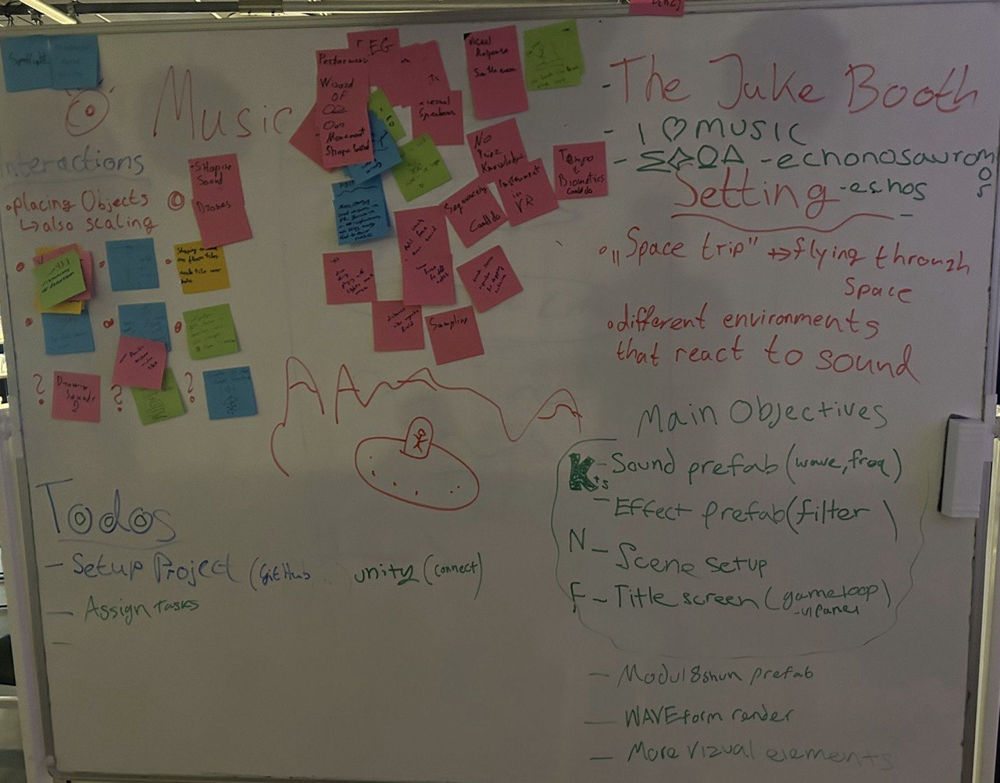

# SoundLab - Team10

## Introduction
An interactive VR experience that creatively simulates the functionality of a synthesizer.

## Design Process

The subject was chosen after two meetings using the Crazy Eights design method.

## System description

### Features
- Customization of sample sounds, including:
   1. Filtering
   2. Modulation
   3. Sound effects
   
- Customization through visual interactions by attaching effect objects to sound objects

- Simultaneous playback of multiple sounds
- using pressure module to recreate sustain pedal effect in piano. 

