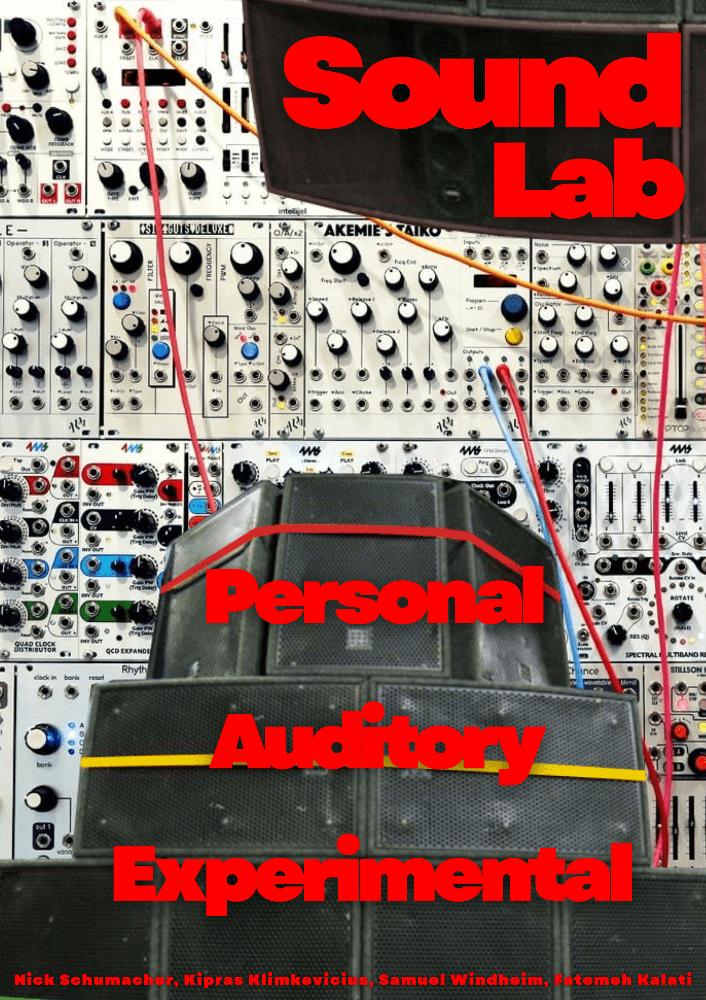

<!-- Place this file at the root of your Unity project.
At the same level than the folders Assets/* -->

# SoundLab



## Introduction

SoundLab is a musical XR experience designed to immerse users in an environment where they can experiment with looped sounds and explore how different audio elements harmonize and complement each other. The platform encourages creativity and interaction, allowing users to layer, modify, and create sounds in real time.

The project addresses the lack of intuitive tools for musical experimentation in XR, where users often face technical barriers when exploring interactive soundscapes.

The proposed solution provides an engaging interface that gives users the ability to create and manipulate music, making musical exploration more approachable in XR.

## Design Process

We began by brainstorming ideas and pitching them to each other. We then refined the concepts collaboratively. For interactions and core concepts, we used the "Crazy 8" technique to rapidly sketch and explore possibilities. This helped us identify  directions and prioritize features for development.

- **Brainstorming:** Collaborative sessions to generate and share project ideas.
- **Crazy 8:** Rapid sketching exercise to explore interaction concepts.
- **Concept Selection:** Evaluated and discussed sketches to choose the best solutions.

## System description

### Features

- **Immersive Low-Poly Environment:** A visually appealing, stylized world designed for musical exploration, optimized for performance in XR.
- **Hand Tracking & Intuitive Controls:** Interact with sounds and objects using natural hand gestures. 
- **Playable Sound Loop Objects:** Floating spheres in the environment represent different musical loops. Pinch them to start the sound; once active, they spin and change color to provide clear visual feedback.
- **Tangible Force Sensor Instrument:** A separate instrument represented as a blue particle orb. Step on the physical pressure pad on the floor to trigger this instrument. Grab and scale the blue particle orb to dynamically control the instrument's characteristics.
- **Synchronized Loop System:** All audio elements are managed by a `LoopManager` that ensures every sound stays perfectly in time, regardless of when it is activated.
- **Sustain & Mute Toggles:** Use a "Sustain" pose to keep sounds playing after release. While sustained, pinching an object again mutes its audio while keeping it in sync with the loop.
- **Demo Video:** Watch the demo at this [site](https://extralitylab.dsv.su.se/) to see SoundLab in action.

## Installation

### Important
The operating version of the project is in the branch **main**.
```bash
git checkout sam-at-ek
```

### Requirements
- **Unity 6000.0.0f1 or higher**

### Setup
1. Clone the repository:
   ```bash
   git clone https://github.com/otnick/SoundLab.git
   ```
2. Open the project in Unity.
3. Ensure that Hand Tracking is enabled in the XR Plug-in Management settings.
4. Add the scenes `Assets/Scenes/TitleScene.unity` and `Assets/Scenes/GameScene.unity` to the build settings.
5. Build and Run to your Meta Quest device.

## Usage

- **Tangible instrument:** Control the blue particle orb by pinch grabbing and scaling it, and stepping on the pressure pad on the floor to trigger the instrument.
- **Activate Sound:** Pinch a floating sound object to start its loop.
- **Sustain Sound:** Trigger the "Sustain" pose (e.g., fist with left hand) to keep a sound playing after you let go. The object will continue to spin.
- **Mute/Unmute:** While a sound is sustained, pinch it again to toggle mute it.
- **Global Stop:** Turning off the "Sustain" pose will deactivate all currently sustained sounds.

## Contributors

- **Fatemeh Kalati**
- **Kimpras Klimkevicius**
- **Nick Schumacher** - schumacher@nickot.is 
- **Samuel Windheim** - sam@windheim.org
