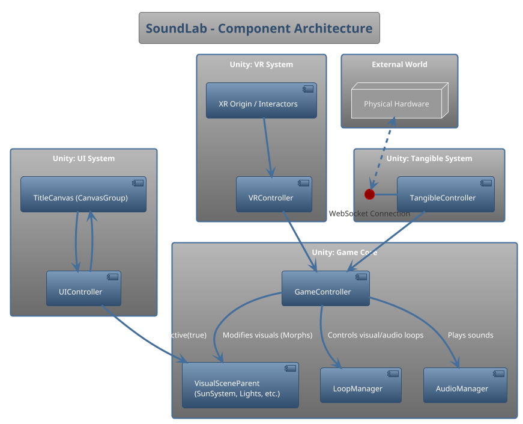

```plantuml
@startuml
skinparam componentStyle uml2
skinparam backgroundColor transparent
skinparam packageStyle rectangle

title SoundLab - Component Architecture
!theme spacelab
package "External World" {
    node "Physical Hardware" as Hardware
}

package "Unity: Tangible System" {
    interface "WebSocket Connection" as WS
    [TangibleController] as TangibleCtrl
    
}

package "Unity: VR System" {
    [XR Origin / Interactors] as XRRig
    [VRController] as VRCtrl
    

}

package "Unity: UI System" {
    [TitleCanvas (CanvasGroup)] as TitleUI
    [UIController] as UICtrl
    
}

package "Unity: Game Core" {
    [GameController] as GameCtrl
    [LoopManager] as LoopMgr
    [AudioManager] as AudioMgr
    [VisualSceneParent\n(SunSystem, Lights, etc.)] as Environment
}

' --- Relationships ---

' Tangible Flow
Hardware <..> WS 
WS - TangibleCtrl
TangibleCtrl --> GameCtrl 

' VR Flow
XRRig --> VRCtrl
VRCtrl --> GameCtrl

' UI Flow
TitleUI --> UICtrl 
UICtrl --> TitleUI 
UICtrl --> Environment : SetActive(true)

' Core Routing
GameCtrl --> LoopMgr : Controls visual/audio loops
GameCtrl --> AudioMgr : Plays sounds
GameCtrl --> Environment : Modifies visuals (Morphs)

@enduml

```